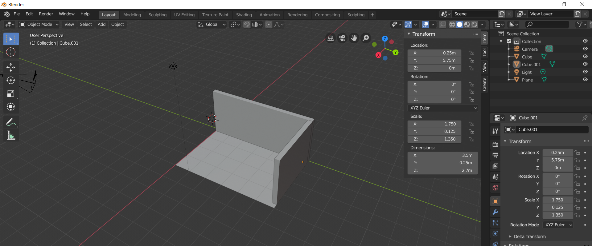

# Instalacja Blendera

Wejdź na stronę: https://www.blender.org/download/
i pobierz plik instalacyjny.


Uruchom instalator i zainstaluj program.


Uruchom Blender


# Nowy projekt

Po otwarciu programu zobaczysz okno tworzenia nowego projektu.


Kliknij w "General" lub po prostu gdzieś poza tym małym oknem.

Wtedy zniknie okienko i będzie widać w całości główne okno projektu.


Domyślnie w projekcie znajdują się 3 obiekty:
* Sześcian
* Kamera
* Światło

Oprócz tego zawsze widoczny jest też **Kursor 3D** (to biało-czerwone kółko w środku).

# Model mieszkania

## Początek

```
1. Utwórz nowy projekt: File - New - General
2. Zaznacz sześcian kliknięciem LPM (Lewy Przycisk Myszy)
3. Usuń sześcian klawiszem DEL
```


## Podłoga

```
1. Dodaj płaszczyznę: Add - Mesh - Plane
2. Zmień punkt odniesienia na lewy dolny róg
   a. Wciśnij TAB
   b. Zaznacz wierzchołek w lewym dolnym rogu
   c. Wybierz: Mesh - Snap - Cursor to Selected
   d. Wciśnij TAB
   e. Wybierz: Object - Set Origin - Origin to 3D Cursor
3. Odkryj panel przekształcania obiektu
4. Zmień pozycję na 0, 0
5. Zmień wymiary na 4, 6
```

1. Dodaj płaszczyznę: **Add - Mesh - Plane**


2. Zmień punkt odniesienia na lewy dolny róg

a. Wciśnij TAB


b. Zaznacz wierzchołek w lewym dolnym rogu


c. Wybierz: Mesh - Snap - Cursor to Selected


d. Wciśnij TAB


e. Wybierz: Object - Set Origin - Origin to 3D Cursor


3. Odkryj panel przekształcania obiektu


4. Zmień pozycję na 0, 0


5. Zmień wymiary na 4, 6


## Pierwsza ściana

```
1. Dodaj sześcian: Add - Mesh - Cube
2. Zmień punkt odniesienia na lewy dolny róg
3. Zmień pozycję na 0, 0, 0
4. Zmień wymiary na 0.25, 6, 2.7
```


## Druga ściana

```
1. Zaznacz pierwszą ścianę
2. Skopiuj ścianę: SHIFT + D i kliknij LPM (Lewy Przycisk Myszy)
3. Zmień pozycję na 0.25, 5.75, 0
4. Zmień wymiary na 3.5, 0.25, 2.7
```


## ...

W ten sposób można modelować kolejne ściany / obiekty.

W każdym momencie możesz przesuwać / obracać scenę, żeby sprawdzić efekty.




# Obsługa Blendera

## Zaznaczanie obiektów

Obiekty można zaznaczać klikając w nie **LPM** (Lewy Przycisk Myszy).

## Panele po prawej stronie

W panelu po prawej stronie widać:

* Na górze - Listę obiektów w scenie
* Na dole - Parametry zaznaczonego obiektu


## Ikony pomocnicze

W prawym gównym rogu sceny znajdują się ikony pomocnicze.

Najważniejsze to:

* **Gizmo** - kolorowe osie X Y Z

Pokazuje, w ktorą stronę biegnie, która oś.

To będzie bardzo potrzebne w momencie, gdy będzie trzeba przesunąć obiekt tylko w wybranej osi (np. przesunąć w lewo, ale zachowując cały czas tą samą wysokość).


* **Tryb wyświetlania** - ikony kulek

Zmieniają sposób, wyświetlania sceny.


Pierwsza opcja pokazuje tylko siatkę (puste ściany obiektu).


Druga opcja pokazuje obiekty wypełnione.

To jest domyślna opcja do modelowania na etapie, w którym kolory i tekstury obiektów nie mają znaczniea.


Dwie ostatnie opcje pokazują obiekty już z materiałami (kolor, tekstura) oraz oświetlenie i cienie, ale też np. lustra.


Trzecia opcja działa szybciej od czwartej, ale daje tylko mniej więcej obraz tego jak wygląda scena.

Czwarta opcja renderuje już całkiem dokładnie, chociaz nadal jest to renederowanie w czasie rzeczywistym i Blender ma opcję renderowania docelowego, które jest dużo bardziej dokładne.

Każdego z powyższych widoków można używać do modelowania sceny, ale używanie dwóch ostatnich nie ma sensu dopóki obiekty nie mają przypisanych materiałow i nie są poustawiane światła.

# Manipulowanie sceną

## Obracanie sceny

Wciśnij **ŚPM** (Środkowy Przycisk Myszy - rolka) i trzymając go przeciągnij kursor.

W ten sposób obracasz scenę.


## Przesuwanie sceny

Wciśnij i trzymaj klawisz **SHIFT** i wciśnij **ŚPM** (Środkowy Przycisk Myszy - rolka) i trzymając go przeciągnij kursor.

W ten sposób przesuwasz scenę.


## Wybór widoku

Możesz też ustawić wybrany widok (np. z góry, z boku) używając klawiszy na klawiaturze numerycznej lub wybierając z menu.


Po zmianie widoku na wybrany możesz go dowolnie zmieniać obracając i przesuwając scenę.

# Modelowanie

## Przesuwanie, skalowanie i obracanie obiektu

Wciśnij jeden z poniższych klawiszy, żeby wywołać akcję.

* **G** - przesuwanie (Grab = Chwyć)
* **S** - skalowanie (Scale = Skaluj)
* **R** - obracanie (Rotate = Obróć)

Po wciśnięciu klawisza możesz przesuwać / skalować / obracać obiekt kursorem.

Żeby ograniczyć akcję w danej osi wciśnij jeden z klawiszy:

* **X** - ogranicza w osi X
* **Y** - ogranicza w osi Y
* **Z** - ogranicza w osi Z

**Gizmo** widoczne w prawym górnym rogu podpowiada, która oś biegnie, w którym kierunku.


Żeby zakończyć akcję kliknij **LPM** (Lewy Przycisk Myszy).

Np.

Wciśij **G**, następnie wciśnij **X**.


Przesuń kursor i wciśnij **LPM**.

Obiekt został przesunięty tylko w osi **X**.


### Przekształcenie o wpisaną wartość

Możesz przekształcić (przesunąć, skalować, obrócić) obiekt o wybraną wartość.

Np. przesunąć o 2m, obrócić o 45°, itd.

Żeby to zrobić wywołaj akcję, a następnie wpisz wartość na klawiaturze i kliknij **LPM** (Lewy Przycisk Myszy).

Np.
```
 G, Y, 2, LPM - przesuwa o 2m w osi Y
 R, Z, 45, LPM - obraca o 45° w osi Z 
```

### Przekształcenie przez panel

W prawym górnym rogu można odkryć panel, który ułatwia zmianę parametrów obiektu (wymiary, pozycję, obrót).

* Location = Pozycja
* Rotation = Obrót
* Scale = Skala
* Dimensions = Wymiary

Ja w tym panelu zmieniam pozcyję i wymiary, a do obracania używać klawisza **R**.


## Punkt odniesienia

Domyślnie wszystkie obiekty mają punkt odniesienia w środku.

Czyli mając sześcian w pozycji 0, 0, 0 (X, Y, Z) to jego środek będzie w tej pozycji.


To jest niewygodne w przypadku modelowania mieszkania, ponieważ łatwiej jest ustalać pozycję obiektów, gdy mają punkt odniesienia w lewym dolnym rogu.

### Zmiana punktu odniesienia

Zaznacz obiekt i wciśnij klawisz **TAB** - włączył się tryb, który służy do modelowania wybranego obiektu (czyli np. można zmienić jego kształt, ale już nie można zmieniać jego pozycji i wielkości).


Zaznacz wierzchołek w lewym dolnym rogu używając **LPM** (Lewy Przycisk Myszy).


Z menu wybierz opcję **Mesh - Snap - Cursor to Selected**


**Kursor 3D** (to małe biało-czerwone kółko, które było na środku sceny) przesunie się na pozycję zaznaczonego wierzchołka.


Wciśnij klawisz **TAB**, żeby wyłączyć tryb edycji.


Z menu wybierz opcję **Object - Set Origin - Origin to 3D Cursor**


Punkt odniesienia obiektu przeniesie się w miejsce **Kursora 3D**, czyli w miejsce wierzchołka w lewym dolnym rogu.


Punkt odniesienia obiektu jest widoczny jako pomarańczowa kropka.
