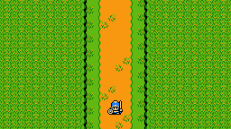
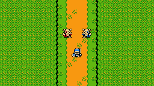
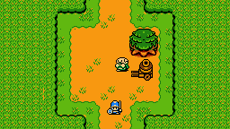
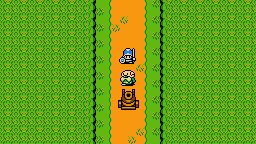
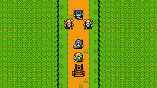
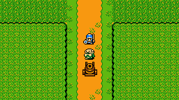
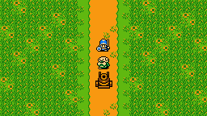
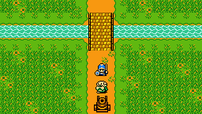
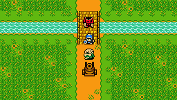
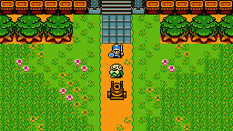

1. EXT. LAS - WIECZÓR

Leśny trakt w stronę zamku.
Traktem idzie chłopiec. U boku ma miecz.

        CHŁOPIEC
    Ciekawe jak daleko do zamku.

Idzie dalej.

        CHŁOPIEC
    Idę od trzech dni i ciągle ten sam nudny las.

Idzie dalej.

        CHŁOPIEC
    Może zejdę ze ścieżki i coś upoluję?

Zastanawia się.

        CHŁOPIEC
    Chyba jest na to trochę za późno.
    Lepiej będzie jak znajdę miejsce na nocleg.

Idzie dalej.
Po chwili z lasu wyskakuje dwóch bandytów.

        BANDYTA 1
    Trafiła nam się jakaś zbłąkana owieczka.

        BANDYTA 2
    Dokąd idziesz chłopcze?
    Może do zamku? Pewnie masz dobra, którymi mógłbyś się podzielić?

        BANDYTA 1
    Chyba nie chcesz przejść tędy za darmo?

        CHŁOPIEC
    Niczego ode mnie nie dostaniecie.

        BANDYTA 2
    To się okaże.

Walczą.
Chłopiec wygrywa.
Idzie dalej. Dochodzi do polany w lesie.

2. EXT. POLANA W LESIE - WIECZÓR

Na polanie stoi wóz, a przy nim siedzi starzec.
Chłopiec podchodzi do starca.

        CHŁOPIEC
    Dzień dobry.
    Pewnie zmierza Pan do zamku?

        STARZEC
    Tak.
    Długa droga za mną, wiec zatrzymałem się na chwilę, żeby odpocząć.
    Też idziesz na zamek?

        CHŁOPIEC
    Tak.
    Od trzech dni jestem w tym lesie.
    Daleko jeszcze do zamku?

        STARZEC
    Nie więcej jak dzień drogi.
    Warto tutaj zostać, żeby przenocować.

        CHŁOPIEC
    Właśnie szukałem dobrego miejsca na nocleg.
    Nie masz nic przeciwko, że tu zostanę?

        STARZEC
    Skąd. Brakuje mi towarzystwa.
    Będę też czuł się bezpieczniej.
    Słyszałem, że od jakiegoś czasu w lesie grasują bandyci.

        CHŁOPIEC
    Niedawno napadło mnie dwóch.
    Ale cherlawych, więc bez problemu się z nimi rozprawiłem.

        STARZEC
    To dobra wieść.
    Jestem [RUNPERT].
    A jak Tobie na imię imię pogromco bandytów [LASU GUUL].

        CHŁOPIEC
    [SIGUND]

        RUNPERT
    Witaj Sigundzie.
    Ruszajmy skoro świt, żeby dotrzeć jutro do zamku.

Przychodzi noc.
Rano budzi się Sigund.
Runpert wstał wcześniej.

        RUNPERT
    Już świta. Pora ruszać.

        CHŁOPIEC
    Wstanę na nogi i jestem gotowy.

Sigund wstaje.
Ruszają w drogę.
Idą lasem.

        SINGURD
    Byłeś już kiedyś na zamku?

        RUNPERT
    Wiele razy.
    Co roku sprzedaję tam wyroby garncarzy z okolicznych wiosek.

        SINGURD
    Podobno zamek i okolice dręczy ogr?

        RUNPERT
    Tak. Co miesiąc przysyła swoją bandę po okup.
    Jest na tyle silny, że wojownicy nie potrafią sobie z nim poradzić.
    Dlaczego pytasz?

        SINGURD
    Słyszałem, że jest za niego nagroda.
    Chciałbym spróbować swoich sił.

Runpert się zatrzymuje.
Singurd też.

        RUNPERT
    To niebezpieczne chłopcze.
    Ogr nie jest sam. Włada okolicznymi trollami.
    Jednego spotkamy po drodze.
    Żyje pod mostem na drodze do zamku i żąda opłaty za przejście.

        SINGURD
    To będzie dobry początek.

        RUNPERT
    Nie bądź lekkomyślny.
    Walcząc z nim ryzykujesz nie tylko swoim życiem, ale też moim.

        SINGURD
    Obiecuję, że nic Ci się nie stanie.

        RUNPERT
    Trzymam Cię za słowo.

Idą dalej.

Z lasu wyskakuje dwóch bandytów.

Rycerz z nimi walczy i wygrywa.

Po drodze spotyka kupca, który zmierza do zmku.
Kupiec prosi, żeby rycerz podróżował razem z nim, ponieważ ostatnio coraz więcej zbójów pojawia się na drodze.
W zamian otrzyma niewielką zapłatę jak dojadą do zamku.

Rycerz i kupiec razem idą przez las.

Pojawia się banda zbójów.

Rycerz ich pokonuje.
Rycerz i kupiec wychodzą z lasu na pola.
W oddali widać pola i zamek.

## Pola przed zamkiem

Idą przez pola.
W okolicy nikogo nie ma.

Dochodzą do mostu.

Spod mostu wyskakuje troll, który żąda opłaty za przejście.
Kiedy rycerz i kupiec nie chcą zapłacić troll atakuje ich.

Rycerz pokonuje trolla.
Idą dalej w stronę zamku.

Dochodzą do zamku.

## Zamek

Dojeżdżają do zamku.
Wrota są otwarte. Strażnicy martwi.

Na dziedzińcu są ludzie, ale chodzą jak w śnie i odpowiadają tylko pomrukami.

Woźnica wraca daje niewielką zapłatę rycerzowi.
Ma zamiar odjechać i namawia do tego samego rycerza.

Rycerz woli zostać i sprawdzić co sie stało. To jego przygoda.

Woźnica idzie w stronę wozu i ginie od strzały.
Nie wiadomo kto strzelił i skąd. Ale prawdopodobnie strzelano z murów lub wieży.

## Początek

Rycerz szybko chowa się za wozem, żeby nie zostać postrzelonym.
Pada kolejny strzała, która nie trafia.

Rycerz rozgląda się i szuka schronienia.
Przeskakuje pod mury do stajni i chowa sie pod zadaszeniem.

Przeszukuje stajnie i znajduje wystraszonego wieśniaka chowającego się w rogu.

Okazuje się, że tego samego dnia grupa zbrojnych wraz z magiem zaatakowała zamek. Na ludzi rzucono urok, a króla zniewolono.
Bandyci właśnie plądrują zamek.

Rycerz postanawia powstrzymać bandytów.

## Plan działania

Rycerz wypytuje ile było bandytów i gdzie teraz są.
Wieśniak widział 7 bandytów. Nie wie gdzie mogą teraz być. Ale pewnie poszli do skarbca i spiżarni.
Są też pewnie na murach.

Do stajni wchodzi jeden z bandytów.
Rycerzowi udaje się go zabić.

Postanawia wziąć strój bandyty i udawać jednego z nich.

## Przez zamek

Rycerz idzie przez przez dziedzieniec na wieże mając nadzieję, że uda mu się zaskoczyć łucznika na murach.

Na murach podchodzi do łucznika.
Łucznik zauważa, że to żaden z jego kompanów, ale rycerz w ostatniej chwili zrzuca go z murów zamku i łucznik ginie.

Rycerz ostrożnie przeszukuje komnaty zamku.
W kuchni znajduje dwóch bandytów, ktorych udaje mu się zabić.

Kolejnych dwóch zabija w korytarzach.

## Sala tronowa

Dochodzi do sali króla.
W sali na tronie siedzi król, obok niego stoi mag i dwóch zbrojnych.

Rycerz woła króla, ale ten nie odpowiada.
Mag rozkazuje zbrojnym zabić rycerza.

Rycerz pokonuje zbrojnych.

Mag rzuca czas na rycerze.
Ale zaklęcie nie działa.

Wystraszony mag zapowiada, że to jeszcze nie koniec i znika.

Rycerz idzie w stronę króla.
W tym momencie do komnaty wpada jeszcze jeden bandyta. Rani rycerza w nogę, ale ginie z ręki rycerza.

Król budzi się z zaklęcia.
Do komnaty wpadają mieszkańcy zamku.

## Epilog

Król dziękuje rycerzowi za ratunek i opowiada co się stało.
Okazuje się, że mag to sługa szalonego króla z sąsiedniego królestwa.
Wraz ze zbrojnymi najechał na zamek.

Zabrali skarb i zapasy.
Ale zabili też królową oraz porawali księżniczkę.

Król prosi rycerza o pomoc w odbiciu księżniczki.
Najpierw jednak rana rycerza w nodze musi się zagoić.

# Credits

zelda_ambis-castle.png -
https://www.spriters-resource.com/game_boy_gbc/thelegendofzeldaoracleofages/sheet/9012/

zelda_sidescrolling.png - https://www.spriters-resource.com/game_boy_gbc/thelegendofzeldaoracleofages/sheet/54369/

zelda_enemies.png - https://www.spriters-resource.com/game_boy_gbc/thelegendofzeldaoracleofages/sheet/9022/

zelda_luna-npcs.png - https://www.spriters-resource.com/game_boy_gbc/thelegendofzeldaoracleofages/sheet/8947/

zelda_plens_house.png - https://www.spriters-resource.com/game_boy_gbc/thelegendofzeldaoracleofages/sheet/9062/

zelda_overworld.png - https://www.spriters-resource.com/game_boy_gbc/thelegendofzeldaoracleofages/sheet/109034/